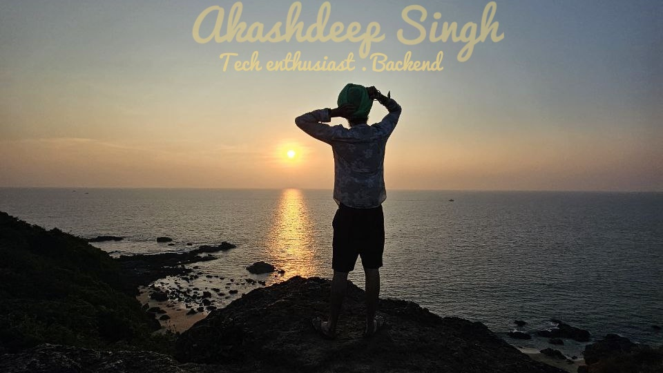

<h2>Hey there! I'm Akashdeep</h2>

### 👨🏻‍💻 &nbsp;About Me

💻 &nbsp; Working as a software engineer at Beltech AI on intelligent traffic management systems. \
💡 &nbsp;As an engineer, I create innovate and scalable solutions that largely impact people day to day life activities \
🌱 To nourish mysql, I read about engineering blogs of internals of programming languages and backend systems.\
⚡  Fun fact: I love treking🏕️, reading novels 📖\
💬 &nbsp;I am passionate about creating amazing, potent software solutions that bring societal improvements and keenly look forward to connect with like-minded professionals.\
📩 &nbsp;You can shoot me an email at akashdeepjassal@gmail.com! I'll try to respond as soon as I can.\
📄 &nbsp;Please have a look at my [Résumé](./assets/akashdeep_resume.pdf) for more details about me.

### 🛠 &nbsp;Tech Stack

&nbsp;
&nbsp;
&nbsp;
&nbsp;
&nbsp;
&nbsp;
&nbsp;
&nbsp;
&nbsp;
&nbsp;
&nbsp;
&nbsp;
&nbsp;
&nbsp;
&nbsp;
&nbsp;
&nbsp;
&nbsp;

### ⚙️ &nbsp;GitHub Analytics

### 🤝🏻 &nbsp;Connect with Me

-----